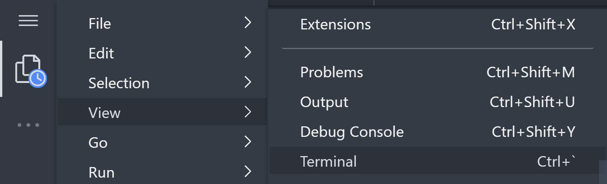
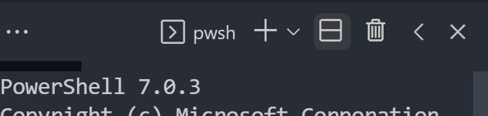
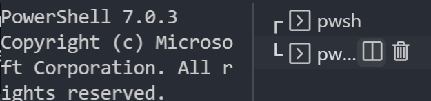
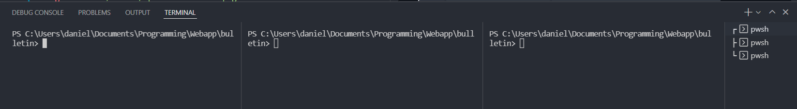
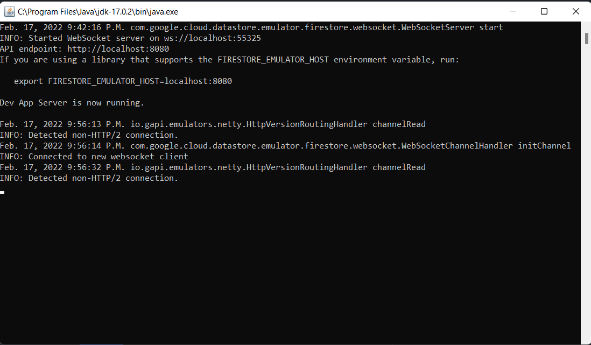
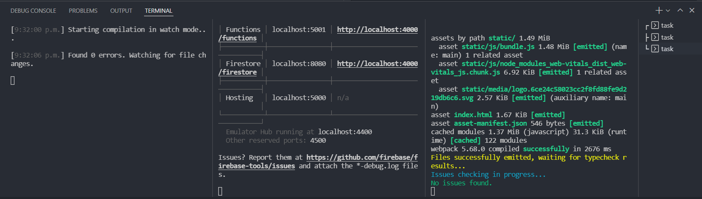

# Bulletin

React App: https://bulletin-be82d.web.app/

# TODO:

- [ ] Design the app
  - [ ] Work on functionality
  - [ ] Figma draft
- [ ] More boilerplate for devs
  - [ ] Connect functions to firestore
  - [ ] Provide CRUD examples of functions
  - [ ] Make client use the provided functions
- [ ] Improve dev documentation
  - [ ] Node
  - [ ] Firebase
  - [ ] Taskfiles
  - [ ] Project Structure
- [ ] Implement auth
- [ ] Implement .env
- [x] Init client with CRA
- [ ] Init Firebase
- [x] Taskfile to automate the following:
  - [x] Install dependencies
  - [x] Client tasks
  - [x] Firebase tasks

# How to Setup

## 1. Install Task

Go to https://taskfile.dev/#/installation

### Windows:

1. Download the task_windows_amd64.zip binary from https://github.com/go-task/task/releases.
2. Extracted the main `task_windows_amd64` folder to somewhere it'll be safe. I used `C:\`.
3. Add the path `C:\task_windows_amd64` to your system variables. See instructions on how to modify the path system varible at https://www.java.com/en/download/help/path.html.

### MacOS:

If you have homebrew, just use the following command.

```
brew install go-task/tap/go-task
```

If not, idk dm me we'll figure it out.

### Linux:

Idk lol google it I guess.

## 2. Install Node

This should be as simple as downloading and running the appropriate installer from https://nodejs.org/en/download/.

## 3. Install firebase-tools

Go to https://firebase.google.com/docs/cli

Use the npm method to install it.

```
npm install -g firebase-tools
```

## 4. Login Into Firebase

Use the following command in the root project directory.

```
firebase login
```

## 5. Install All Required Node Modules

Use the following command in the root project directory.

```
task install
```

# How to Develop

## 1. Open 3 Terminals

You can use 3 seperate terminals if you want, But I think the integrated terminal is easier.

Click on `☰` -> `View` -> `Terminal` to open your integrated terminal.



Press the `◫` or `⊟` button to split your terminal.



And again.



Now you have 3 terminals side by side.



Ensure all of them are in the root project directory, `/bulletin`.

## 2. Run Taskfile Commands

1. In the first terminal, we will run the TypeScript compiler in watch mode.

   This program will watch for any changes in the TypeScript source code, and will automatically recompile the necessary files to JavaScript.

   This recompilation will happen automatically whenever you save a functions `.ts` file, as long as you leave the command running in the terminal.

   All you have to do is run the following command in the first terminal.

   ```
    task build_functions_watch
   ```

   Wait for output:

   ```
   ...

   Found 0 errors. Watching for file changes.
   ```

2. In the second terminal, we will run the firebase emulator.

   This program emulates the functions, as well as other auth, hosting, or firestore features, but only locally, which is useful for testing.

   As long as you keep the compiler running in terminal 1, and the emulator running in terminal 2, the emulator will automatically read and serve the newly compiled files.

   Run the follwing command in the second terminal.

   ```
   task emulate_firebase
   ```

   Wait for output:

   ```
   ...

   Emulator Hub running at localhost:4400
   Other reserved ports: 4500

   Issues? Report them at https://github.com/firebase/firebase-tools/issues and attach the \*-debug.log file
   ```

   This may also pop up a java.exe program.

    

   Leave this running, until you shut down the emulator process in this terminal.

3. In the third terminal, we will locally serve the client-side React App.

   Once again, the compiler runs automatically behind the scenes and should update the browser page.

   All you have to do is run the follwing command in the third terminal.

   ```
   task emulate_client
   ```

   Once it is done, it should automatically open up the web app in the browser.

## 3. Voila!

You should now have 3 processes running in your terminals.



You can view the React app at http://localhost:3000/.

You can view the Firebase Emulator UI at http://localhost:4000/.

If you browse through the output of terminal 2, you find other important ports, such as functions, which runs at http://localhost:5001/

Go ahead and change some source code in `client/src/App.tsx`.

Feel free to play around! As long as you don't deploy anything to firebase, or push changes to github, any changes you made can be undone by deleting and redownloading the project.

To exit out of development, you can `ctrl` + `c` out of all 3 terminals. Then also close the java.exe, if it is open.
